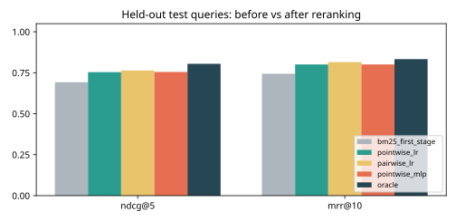
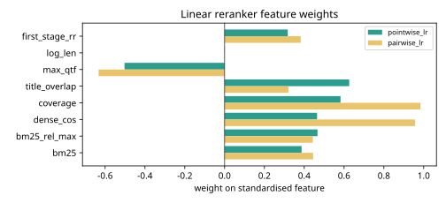

# Results -- ai-learn-17-reranker-scratch

**Seed:** `42` | docs=120 | queries=120 (train 84, test 36, split by topic) | first stage = BM25 top-20 | training pairs: pointwise rows=1680, pairwise pairs=2214 | features=8

First-stage recall@20: train 0.708, test 0.750. A reranker can only reorder these candidates, so `oracle` (ideal order of the candidates) is the ceiling.

## test split (real smoke run)

| system | ndcg@5 | mrr@10 | recall@1 | recall@5 |
|---|---:|---:|---:|---:|
| `bm25_first_stage` | 0.692 | 0.744 | 0.347 | 0.639 |
| `pointwise_lr` | 0.754 | 0.801 | 0.389 | 0.694 |
| `pairwise_lr` | 0.764 | 0.815 | 0.403 | 0.694 |
| `pointwise_mlp` | 0.755 | 0.801 | 0.389 | 0.694 |
| `oracle` | 0.804 | 0.833 | 0.417 | 0.750 |

## train split (real smoke run)

| system | ndcg@5 | mrr@10 | recall@1 | recall@5 |
|---|---:|---:|---:|---:|
| `bm25_first_stage` | 0.750 | 0.804 | 0.381 | 0.684 |
| `pointwise_lr` | 0.792 | 0.857 | 0.429 | 0.702 |
| `pairwise_lr` | 0.794 | 0.857 | 0.429 | 0.708 |
| `pointwise_mlp` | 0.793 | 0.857 | 0.429 | 0.696 |
| `oracle` | 0.805 | 0.857 | 0.429 | 0.708 |

## Test-query flips vs BM25 order (nDCG@5)

| model | improved | unchanged | worse |
|---|---:|---:|---:|
| `pointwise_lr` | 10 | 26 | 0 |
| `pairwise_lr` | 11 | 25 | 0 |
| `pointwise_mlp` | 10 | 26 | 0 |

## Final training loss

| model | first-epoch loss | final loss |
|---|---:|---:|
| `pointwise_lr` | 0.6973 | 0.0826 |
| `pairwise_lr` | 0.7252 | 0.0434 |
| `pointwise_mlp` | 0.2183 | 0.0281 |

## Plots

Wall time: 0.38s on CPU.
